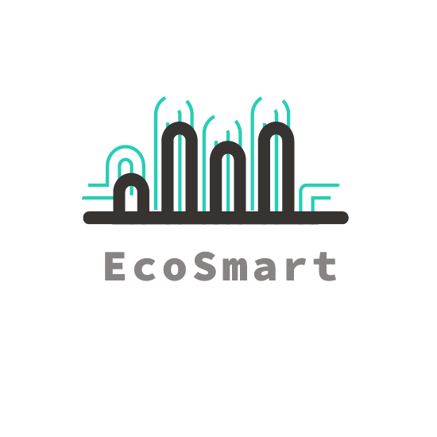

# EcoSmart

  

## Description

EcoSmart est un système de gestion de l'énergie qui vous permet de surveiller, contrôler et optimiser la consommation d'énergie de vos appareils électroménagers dans votre domicile. Le système est composé de plusieurs modules intelligents qui se connectent à vos appareils électroménagers, ainsi qu'à une application sur votre téléphone intelligent ou une interface utilisateur sur votre ordinateur.

## Fonctionnalités clés

* Surveillance en temps réel : Les modules EcoSmart sont équipés de capteurs qui mesurent la consommation d'énergie de vos appareils électroménagers en temps réel. Les données sont collectées et affichées dans l'application, vous permettant de visualiser la consommation d'énergie de chaque appareil individuellement ou de l'ensemble de votre domicile.

* Contrôle à distance : L'application EcoSmart vous permet de contrôler vos appareils électroménagers à distance. Vous pouvez allumer, éteindre, régler la puissance, ou mettre en veille vos appareils directement depuis l'application, ce qui vous permet de gérer votre consommation d'énergie de manière efficace, même lorsque vous n'êtes pas chez vous.

* Programmation des horaires d'utilisation : EcoSmart vous permet de programmer des horaires d'utilisation pour vos appareils électroménagers. Par exemple, vous pouvez définir des horaires d'allumage et d'extinction automatiques pour votre chauffage, votre climatisation, ou vos appareils de divertissement, en fonction de vos besoins et de vos préférences. Cela vous permet de réduire la consommation d'énergie inutile pendant les périodes d'inactivité.

* Recommandations d'optimisation : L'application EcoSmart analyse les données de consommation d'énergie de vos appareils électroménagers et vous fournit des recommandations personnalisées pour optimiser votre consommation d'énergie. Par exemple, elle peut vous suggérer d'utiliser certains appareils pendant les heures creuses de tarification d'énergie, ou de remplacer certains appareils énergivores par des modèles plus efficaces sur le plan énergétique.

* Suivi des économies d'énergie : EcoSmart vous permet de suivre vos économies d'énergie au fil du temps grâce à des rapports détaillés dans l'application. Vous pouvez voir combien d'énergie vous avez économisé, combien d'émissions de carbone vous avez évitées, et comparer vos résultats avec d'autres utilisateurs du système.

* Intégration avec d'autres appareils connectés : EcoSmart peut être intégré avec d'autres appareils connectés dans votre domicile, tels que des thermostats, des capteurs de lumière ou des capteurs de mouvement, pour créer un système de gestion de l'énergie intelligent et complet. Par exemple, le système peut ajuster automatiquement les réglages de température en fonction de votre présence dans la pièce, ou éteindre les lumières lorsque vous quittez la maison.

En développant ce dispositif de gestion de l'énergie, on peut aider les utilisateurs à prendre conscience de leur consommation d'énergie, à optimiser leur utilisation des appareils électroménagers, et à réduire leur empreinte carbone en adoptant des habitudes de consommation d'énergie plus durables.

# Licence

Ce projet est sous licence MIT. Consultez le fichier LICENCE pour plus d'informations.

# Contributors
* [Hayas92](https://github.com/Hayas92)
* [moussa75XIX](https://github.com/moussa75XIX)
* [OussamaAbdelhedi](https://github.com/OussamaAbdelhedi)
* [icisse98](https://github.com/icisse98)
